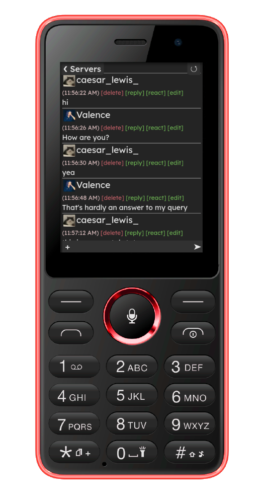

### The Revolt client for low end and obscure devices

<a id="button" href="app">Open Web App</a>

<a id="button" href="https://github.com/DeclanChidlow/unvite">View Source Code</a>

<a id="button" href="https://rvlt.gg/c2RgkaxY">Revolt Server</a>

---

Initially designed as a way to use [Revolt](https://revolt.chat) on KaiOS phones, Unvite is a minimalist, unofficial client which should work on most old and obscure devices. It's very simplistic and should allow for near perfect performance and universal compatibility.

---

### Changelog
Wondering what's new? Check out the changelog [here](/changelog).

---

### Support
Having issues with Unvite? Check out the guides [here](/support).

---

Unvolt is built on Reductv3 by DoruDoLasu. You can view it's source code on [GitHub](https://github.com/DoruDoLasu/Reduct).

 
